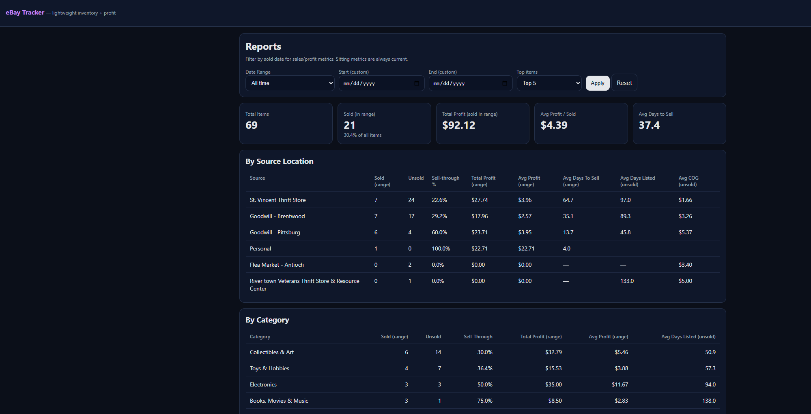
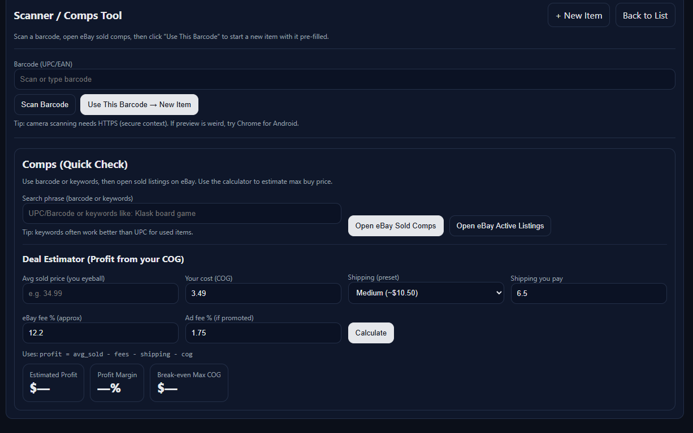
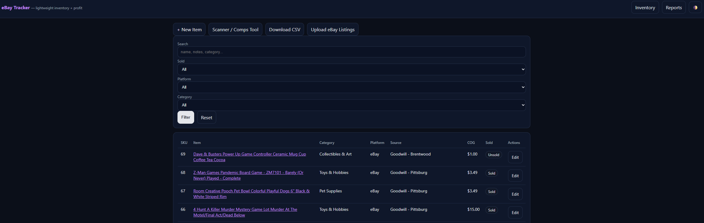

# eBay Tracker

A lightweight, self-hosted inventory and profit-tracking tool built for eBay resellers.

This project is designed to help you **track inventory from acquisition to sale**, understand **true profit**, and make **better sourcing decisions** using real data — without relying on spreadsheets.

---

## Features

### Inventory Management
- Track items with SKU-based records
- Store cost of goods (COG), fees, shipping, and buyer-paid totals
- Upload and manage multiple photos per item
- Mark items as sold / unsold
- Track source location (thrift store, personal, flea market, etc.)

### Reports & Analytics
- Profit metrics by date range
- Sell-through rate
- Average days to sell
- Profit breakdown by:
  - Category
  - Source location
- Top profit items (with thumbnails)
- Long-tail visibility for slow-moving inventory

### Scanner & Comps Tool
- Barcode scanning (UPC/EAN) on mobile
- Quick links to eBay sold & active comps
- Deal estimator:
  - Enter avg sold price + COG
  - Calculates profit, margin, and break-even max COG
- Optimized for in-store sourcing

### eBay Import
- Upload eBay “Active Listings” CSV export
- Fuzzy-match against existing inventory
- Detect potential duplicates
- Confirm before creating or updating records
- Safe import — no blind overwrites

---

## Screenshots

### Reports Dashboard


### Scanner / Comps Tool


### Inventory List


---

## Tech Stack

- **Backend:** Python, Flask
- **Database:** SQLite (SQLAlchemy ORM)
- **Frontend:** Jinja2, vanilla CSS/JS
- **Auth:** Optional HTTP Basic / OIDC
- **Image Handling:** Pillow
- **Deployment:** Docker / Gunicorn friendly

---

## Why This Exists

Most reseller tools either:
- Hide real profit behind estimates, or
- Lock your data behind subscriptions

This tool is:
- Local-first
- Transparent
- Built for resellers who want control over their data

---

## Local Development

```bash
python -m venv venv
source venv/bin/activate
pip install -r requirements.txt
python app.py
```
Notes

- Barcode scanning requires HTTPS on mobile browsers
- Chrome for Android works best for camera access
- SQLite is used by default but can be swapped for Postgres

